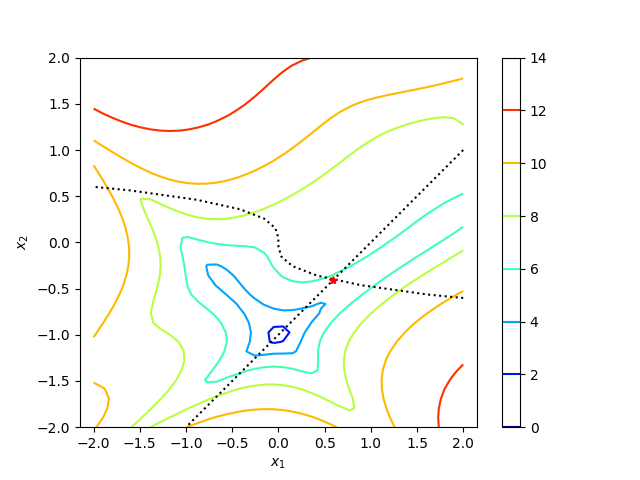
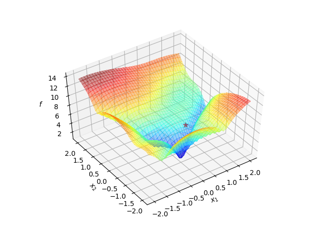

# opt-prob-collection

Optimization problem collections by NTU ME SOLab.

## Requirement

```
python 2.7 or 3
---
numpy
matplotlib
```

## How to Use

### Solution

```python
import opt_prob

name = '2.4 GOLDPR'
problem = opt_prob.Cons(name)

print('-- Problem --')
print(problem)
print('-- Solution --')
print(problem.xopt)
print(problem.fopt)
```

```
>>>
-- Problem --

2.4 GOLDPR

Dimensions: 2

Goldstein Price
L.Pronzato, E.Walter, A.Venot, and J.F.Lebruchec. "A general purpose global
optimizer: Implementation and applicaitons". Mathematics and Computers in Simulation,
26:412-422, 1984.


-- Solution --
[0.5955, -0.4045]
5.6694
```

### Ploting

```python
import opt_prob

name = '2.4 GOLDPR'
problem = opt_prob.Cons(name)

opt_prib.plot(problem)
```




### scipy.optimize

```python
import numpy as np
import opt_prob
import scipy.optimize

# -- problem setup

name = '2.4 GOLDPR'
problem = opt_prob.Cons(name)

def cns(x):
    g = -1.0*np.array(problem.cns(x))
    return g.tolist()

# -- start optimization

x0 = ((np.array(problem.lb) + np.array(problem.ub)) / 2.0).tolist()

bounds = []
for lb_i, ub_i in zip(problem.lb, problem.ub):
    bounds.append((lb_i, ub_i))

ineq_cons = {'type':'ineq', 'fun': cns}
method = 'SLSQP'
options = {'disp': True}

res = scipy.optimize.minimize(problem.obj, x0, method=method, bounds=bounds,
                              constraints=ineq_cons, options=options)
```

### SOLab DIRECT Algorithm

```python
import direct
import opt_prob

# -- problem setup

name = '2.5 GOMEZ'
problem = opt_prob.Cons(name)

# -- start optimization

solver = direct.Solver(problem)
solver.optimize()
```

## Reference

1. https://www.sfu.ca/~ssurjano/optimization.html
2. http://infinity77.net/global_optimization/test_functions.html#test-functions-index
3. http://www-optima.amp.i.kyoto-u.ac.jp/member/student/hedar/Hedar_files/TestGO.htm
